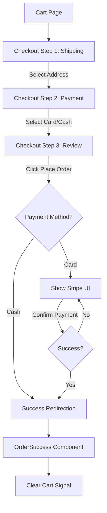

# ExpressoCart Checkout Feature Documentation

This document provides a comprehensive deep dive into the **Checkout Feature** within the ExpressoCart application. It covers component architecture, state management, API integrations, and the complete order lifecycle.

---

## 1. Feature Overview
The Checkout process is a multi-step workflow designed to guide the user from cart review to order confirmation. It is structured as a single-page stepper that manages state dynamically without page reloads (until the final success page).

### The Multi-Step Flow:
1.  **Shipping Information**: Selection of a saved address or entry of a new one.
2.  **Payment Selection**: Choosing between "Card" (Stripe) or "Cash on Delivery".
3.  **Order Review & Payment**: Final review of items and address, followed by order placement or integrated card payment.
4.  **Order Success**: Landing page after the order is confirmed by the backend.

---

## 2. Component Architecture

The checkout feature is modular, consisting of a main container and several specialized child components.

### 2.1 Main Container: `Checkout` (`checkout.ts`)
The orchestrator of the entire process.
-   **Responsibility**: Manages the `currentStep` state, holds shared order data (address, payment method), and coordinates the final `placeOrder` API call.
-   **Key State**:
    -   `currentStep`: Number (1, 2, or 3).
    -   `resolvedAddressObj`: The raw address object sent to the API.
    -   `selectedPayment`: String ('Card' or 'Cash').
    -   `activeClientSecret`: Stripe's client secret for card payments.
    -   `isPlacingOrder`: Signal for loading states.

### 2.2 Child Components

| Component | Responsibility | Inputs / Outputs |
| :--- | :--- | :--- |
| **`CheckoutStepper`** | Visual progress bar showing steps (Shipping, Payment, Review). | `[currentStep]` |
| **`CheckoutShipping`** | Handles saved/new address logic. Fetches user data via `AuthApi`. | `(nextStep)` -> Emits address & formatted string. |
| **`CheckoutPayment`** | Simple toggle between Card and Cash. | `(nextStep)`, `(backStep)` |
| **`CheckoutReview`** | Displays summary, address, and embeds Stripe Card UI if "Card" is selected. | `[resolvedAddress]`, `[selectedPayment]`, `(placeOrder)`, `(paymentSuccess)` |
| **`CheckoutSummary`** | Sidebar showing cart items, subtotal, discount, and final price. | Uses `CartService` Signal directly. |

---

## 3. Detailed Logic & Functions

### 3.1 Step Transitions
Each step notifies the parent `Checkout` component when it finishes.
-   **`onShippingNext(event)`**: Saves the address and moves to Step 2.
-   **`onPaymentNext(payment)`**: Saves the method and moves to Step 3.
-   **`goStep(n)`**: Allows the user to navigate back to previous steps via "Back" buttons or the stepper.

### 3.2 Order Placement Logic (`placeOrder`)
This is the most critical function in `checkout.ts`.

```typescript
placeOrder() {
  const orderData = {
    cartId: this.cartService.cart()._id,
    shippingAddress: this.resolvedAddressObj,
    paymentMethod: this.selectedPayment
  };

  this.orderService.createOrder(orderData).subscribe({
    next: (res) => {
      // 1. If Cash: Redirect to success immediately
      if (this.selectedPayment === 'Cash') {
        this.handleSuccess(res.data._id);
      } 
      // 2. If Card: Stay on page and initialize Stripe UI
      else if (this.selectedPayment === 'Card') {
        this.orderService.payCard(res.data._id).subscribe({
          next: (payRes) => {
            this.activeClientSecret.set(payRes.clientSecret);
          }
        });
      }
    }
  });
}
```

### 3.3 Stripe Integration (`CheckoutReviewComponent`)
When `activeClientSecret` is set, `CheckoutReview` reacts via `ngOnChanges`:
1.  Calls `cardPaymentService.initializeElements`.
2.  Mounts the Stripe **Payment Element** into the `#payment-element` div.
3.  On `confirmPayment()`, it calls Stripe's SDK. If successful, it emits `paymentSuccess`.

---

## 4. API Calling Stack

The feature interacts with several backend endpoints through the `OrderService` and `CartService`:

-   **`POST /orders`**: Creates an initial order record in "Pending" status.
-   **`POST /orders/:id/pay-intent`**: Generates a Stripe Client Secret for an existing order.
-   **`GET /cart`**: Fetches current cart state (managed via Angular Signals).
-   **`GET /me`** (via `AuthApi`): Fetches saved user addresses for the shipping step.

---

## 5. Layout & UI Logic (HTML/Conditions)

### 5.1 Dynamic View Switching (`checkout.html`)
The main layout uses Angular's `@if` control flow to switch between steps:
```html
<div class="grid lg:grid-cols-[1fr_360px] ...">
  <div class="space-y-6">
    @if (currentStep === 1) { <app-checkout-shipping ... /> }
    @if (currentStep === 2) { <app-checkout-payment ... /> }
    @if (currentStep === 3) { <app-checkout-review ... /> }
  </div>
  <app-checkout-summary /> <!-- Always visible -->
</div>
```

### 5.2 Conditional Error Handling (`checkout.ts`)
The `handleError` function contains specific logic for various backend failure states:
-   **"already has a placed order"**: Redirects to `/profile/orders` as the user shouldn't checkout twice for the same items.
-   **"pending card order"**: Alerts the user about an unfinished payment and offers to redirect to orders.
-   **"Cart is empty"**: Redirects back to the Shop.
-   **"Insufficient stock"**: Displays a toast error notification.

---

## 6. Post-Checkout Flow (`OrderSuccess`)

After a successful placement (Cash) or confirmation (Card):
1.  The user is redirected to `/checkout/success?orderId=...`.
2.  The `OrderSuccess` component:
    -   Displays the **Order ID**.
    -   **CRITICAL**: Clears the local `CartService` Signal state to reflect the cart is now empty.
    -   Provides buttons to "Continue Shopping" or "Track My Order".

---

## 7. Workflow Diagram



---

## 8. Development Notes
-   **Performance**: `ChangeDetectionStrategy.OnPush` is used in the main component to optimize performance.
-   **Security**: Payment information is never handled directly by the frontend; it is processed through Stripe's secure iframes.
-   **Signals**: The `CartService` uses Angular Signals (`signal<CartData>`) for real-time reactivity across `CheckoutSummary` and the header cart badge.

---

## 9. CheckoutReviewComponent Deep Dive

The `CheckoutReviewComponent` is the final checkpoint before order completion. It serves two main purposes: visual summary and payment execution.

### 9.1 Inputs and Outputs
-   **Inputs**:
    -   `resolvedAddress`: Formatted string of the selected delivery address.
    -   `selectedPayment`: The payment method choice ('Card' or 'Cash').
    -   `isPlacingOrder`: Boolean indicating if the initial `POST /orders` is in progress.
    -   `clientSecret`: The Stripe secret (if method is Card). Its presence triggers the Payment Modal.
    -   `orderId`: The ID of the order created by the parent.
-   **Outputs**:
    -   `backStep`: Navigates to Step 2.
    -   `placeOrder`: Triggers the initial order creation in the parent.
    -   `paymentSuccess`: Notifies the parent that Stripe payment succeeded.
    -   `paymentError`: Reports Stripe SDK errors.

### 9.2 The "Cash" Flow
When `selectedPayment === 'Cash'`, the integrated Stripe modal is bypassed.
1.  User clicks **"Place Order"**.
2.  `placeOrder.emit()` is called.
3.  Parent (`Checkout.ts`) calls the API and, upon success, redirects directly to the success page.

### 9.3 The "Card" Flow (Stripe Integration)
This is the most complex part of the component. It uses a **Modal Overlay** logic.

#### A. Initializing UI (`initStripeUI`)
When the parent successfully creates an order and receives a `clientSecret`, it passes it to this component.
-   The component detects this via `ngOnChanges`.
-   It uses `cardPaymentService` to load the Stripe SDK and mount the **Payment Element**.
-   The **Payment Element** is an iframe-based secure field where users enter card details safely.

#### B. The Integrated Modal (`@if (clientSecret)`)
Once the secret exists, a full-screen backdrop appears.
-   **Visuals**: Shows a "Payment Details" header, the Stripe element, and a "Pay & Confirm" button.
-   **Security**: The card details never touch your server; they go directly to Stripe.

#### C. Confirming Payment (`confirmPayment`)
When the user clicks the "Pay" button inside the modal:
1.  `isConfirmingPayment` is set to `true` (shows a loading spinner).
2.  `cardPaymentService.confirmPayment` is called.
3.  **Handling Results**:
    -   **Success**: Emits `paymentSuccess(orderId)`.
    -   **Processing**: Shows a message that payment is pending.
    -   **Error**: Displays the Stripe error message in a red alert box within the modal.

### 9.4 Lifecycle & Cleanup
To prevent memory leaks and iframe issues:
-   **`ngOnDestroy`**: Explicitly calls `paymentElement.destroy()` to clean up Stripe's internal objects when the user leaves the checkout page.

### 9.5 Conditional Logic Highlights
-   **Button State**: The "Place Order" button is disabled during API calls (`isPlacingOrder`) to prevent double-charging.
-   **Modal Visibility**: The modal only exists in the DOM if `clientSecret` is truthy.
-   **Error Display**: `@if (stripeError())` displays a user-friendly alert box if the card is declined or invalid.
